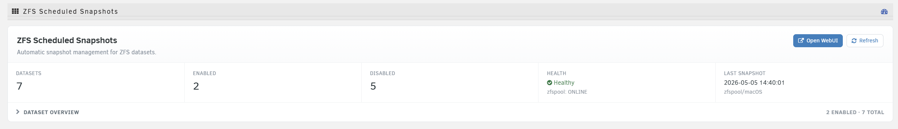
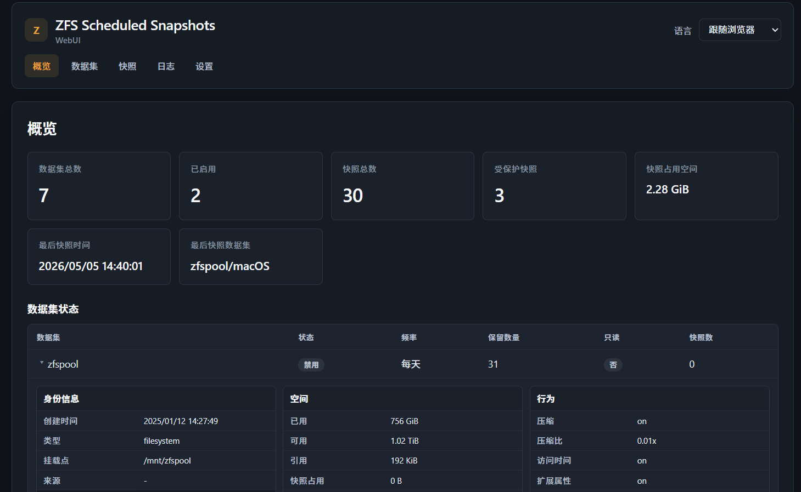
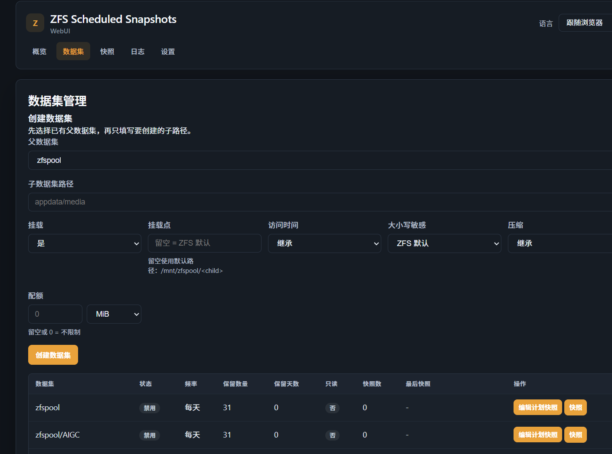
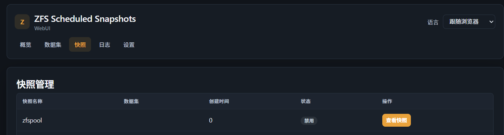
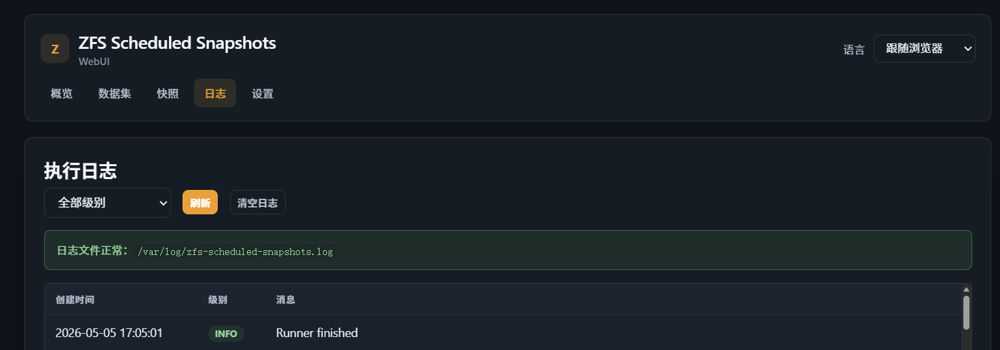

# ZFS Scheduled Snapshots（Unraid 插件）

<div align="center">

[](https://github.com/m0eak/ZFS-Scheduled-Snapshots-Unraid/blob/main/LICENSE)
[](https://github.com/m0eak/ZFS-Scheduled-Snapshots-Unraid/releases)
[](https://github.com/m0eak/ZFS-Scheduled-Snapshots-Unraid/commits)

</div>

> English version: [README.en.md](README.en.md)

---

## ⚠️ 警告

本插件目前仍处于早期开发阶段，尚未经过完整的真实环境回归测试。

请务必谨慎使用：

- 建议仅在**非生产环境**或**已有完整备份**的前提下测试
- 作者**不对任何数据丢失负责**
- 使用前请先确认你了解 ZFS 快照、Hold 与保留策略的基本行为

---

## 📝 简介

**ZFS Scheduled Snapshots** 是一个用于 Unraid 的 ZFS 自动定时快照管理插件。

当前版本采用**分层 UI 架构**：

- **Unraid 插件页**：只负责概览预览和入口跳转
- **独立 WebUI**：负责详细配置、快照管理和日志查看

插件通过后台 Cron 每 5 分钟检查一次，并根据每个数据集的独立配置自动：

- 创建快照
- 清理普通自动快照
- 保留不可变快照（ZFS Hold）
- 处理错过执行时间后的补拍

---

## ✨ 主要功能

- **多周期调度**
  - 5 分钟 / 15 分钟 / 每小时 / 每天 / 每周 / 每月
- **精确时间控制**
  - daily / weekly / monthly 支持指定执行时间
  - weekly / monthly 支持指定星期或日期
- **不可变快照保护**
  - 支持对新快照自动添加 `autosnap` hold
- **双维度保留策略**
  - `keep`：普通自动快照按数量保留
  - `retain_days`：不可变 / 带 hold 快照按天数保留
- **自动补拍**
  - 错过计划执行时间后，下次 runner 会自动补拍
- **分层管理界面**
  - 插件页做预览，WebUI 做完整管理
- **快照手动操作**
  - 支持手动创建、删除、添加 hold、释放 hold
- **日志查看**
  - 支持查看 runner 执行日志、过滤级别、清空日志
- **向下兼容**
  - 保留已有 ZFS property、已有快照和已有 hold

---

## 🏗️ 架构说明

### 1) 插件页（`ZFSScheduledSnapshots.page`）

职责：

- 显示概览统计
- 显示数据集状态摘要
- 提供进入 WebUI 的入口

原则：

- 保持原生 Unraid 风格
- 不再承担复杂配置编辑逻辑

### 2) WebUI

当前包含页面：

- **Dashboard**：概览统计
- **Datasets**：数据集配置管理
- **Snapshots**：快照管理
- **Logs**：执行日志查看

### 3) API + Service 层

后端已拆出：

- **DatasetService**：数据集配置读取、更新、统计
- **SnapshotService**：快照列出、创建、删除、hold 管理
- **LogService**：日志读取、过滤、清空

API 使用统一 JSON 返回格式，便于插件页和 WebUI 复用。

---

## 📸 截图

### 插件预览页


### WebUI - Dashboard


### WebUI - 数据集编辑


### WebUI - 快照管理


### WebUI - 执行日志


---

## 🚀 安装

### 通过 URL 安装（推荐）

在 Unraid 插件管理页面中使用：

```text
https://raw.githubusercontent.com/m0eak/ZFS-Scheduled-Snapshots-Unraid/main/zfs.scheduled.snapshots.plg
```

### 手动安装

1. 下载 `.plg` 文件
2. 上传到 Unraid 插件管理页面
3. 点击安装

---

## 📚 使用说明

### 快速开始

1. 安装插件后，在 Unraid「设置」中打开 **ZFS Scheduled Snapshots**
2. 在插件页查看概览信息
3. 点击 **WebUI** 进入完整管理界面
4. 在 **Datasets** 页面编辑目标数据集配置
5. 保存后等待后台 runner 按计划执行

### 配置项说明

- **启用自动快照**
  - 开启或关闭该数据集的自动快照
- **快照频率**
  - 5min / 15min / hourly / daily / weekly / monthly
- **保留快照数量（keep）**
  - 普通自动快照最多保留多少个，超出后自动删除最旧的
- **快照时间（time）**
  - daily / weekly / monthly 的执行时间，格式 `HH:MM`
- **星期 / 日期（day）**
  - weekly 使用星期，monthly 使用日期
- **新快照设为只读（readonly）**
  - 自动创建后为快照添加 hold 保护
- **只读快照保留天数（retain_days）**
  - 仅影响不可变 / 带 hold 的自动快照，`0` 表示不限制

---

## 🔧 构建

项目通过 GitHub Actions 自动构建。

当前工作流会在以下分支推送时自动打包：

- `main`
- `dev`
- `beta`
- `feature-*`

构建内容包括：

- 更新插件版本号
- 生成 `.tgz` 包
- 更新根目录 `.plg`
- 提交构建产物

---

## 📌 当前进度

当前代码已完成的主要部分：

- 后端基础分层（bootstrap / response / validation / services）
- 插件页预览模式改造
- WebUI 第一版页面
- 数据集编辑能力
- 快照管理能力
- 日志持久化与日志页面
- 构建工作流仓库名修正

当前仍建议继续补的部分：

- README 截图与说明持续校对
- 真实 Unraid 环境升级测试
- 正式发布前回归测试

---

## ⚠️ 免责声明

本软件按“原样”提供，不提供任何形式的明示或暗示担保，包括但不限于：

- 适销性
- 特定用途适用性
- 非侵权性

在任何情况下，作者或版权持有人均不对因软件或软件的使用、分发或其他交易而产生的任何索赔、损害或其他责任负责。

**请务必始终保留重要数据的异地备份。**

---

## 🤝 贡献

欢迎提交 Issue 和 Pull Request。

---

## 📄 许可证

[GPL-3.0 License](LICENSE)
